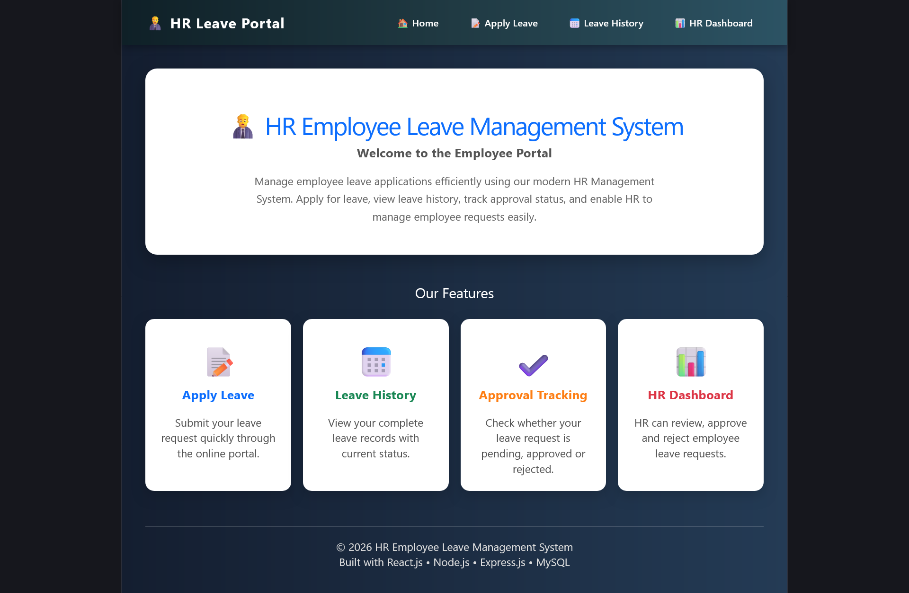
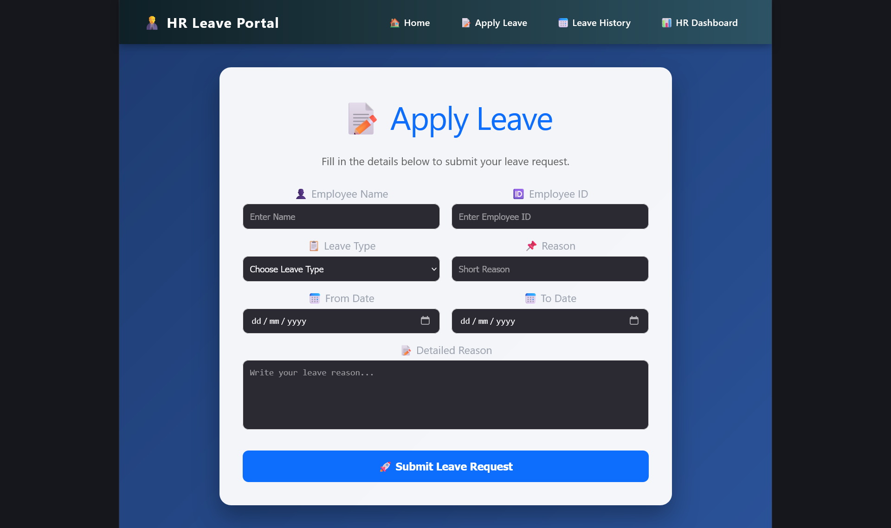
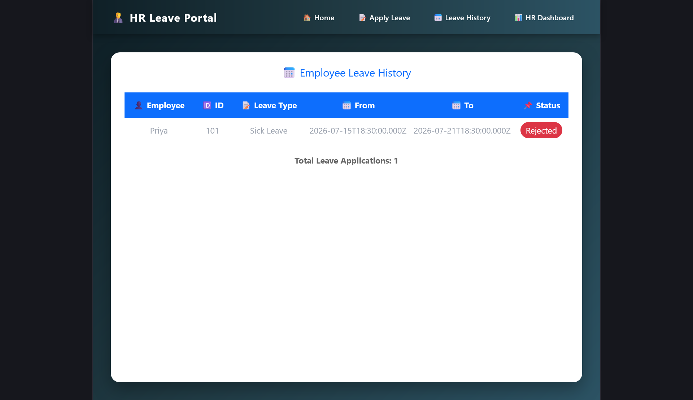
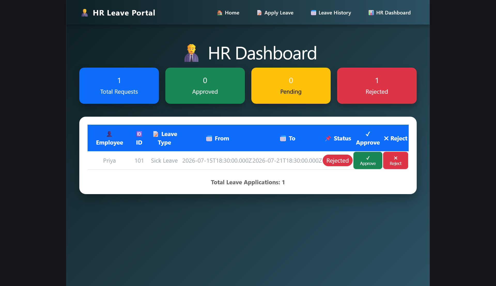

# HR Employee Leave Management System

A full-stack Leave Management System developed using React.js, Node.js, Express.js, and MySQL.

## 📌 Project Overview

The HR Employee Leave Management System allows employees to apply for leave online, while the HR department can view, approve, or reject leave requests.

---

## 🚀 Technologies Used

### Frontend
- React.js
- React Router DOM
- Axios

### Backend
- Node.js
- Express.js
- CORS

### Database
- MySQL

### Development Tools
- VS Code
- MySQL Command Line / MySQL Workbench


## Home Page



## Apply Leave



## Leave History



## HR Dashboard




---

## 📂 Project Structure

```
HR-Leave-Management
│
├── client
│   ├── src
│   ├── public
│   ├── package.json
│   └── vite.config.js
│
├── server
│   ├── config
│   ├── controllers
│   ├── routes
│   ├── server.js
│   └── package.json
│
├── database
│   └── hr_leave.sql
│
└── README.md
```

---

## ✨ Features

- Employee Leave Application
- View Leave History
- HR Dashboard
- Approve Leave
- Reject Leave
- MySQL Database Integration
- REST API using Express.js

---

## ⚙️ Installation

### Clone the repository

```bash
git clone https://github.com/yourusername/HR-Leave-Management.git
```

---

### Install Frontend

```bash
cd client
npm install
```

Start React

```bash
npm run dev
```

---

### Install Backend

```bash
cd server
npm install
```

Start Backend

```bash
node server.js
```

---

## 🗄 Database Setup

Import

```
database/hr_leave.sql
```

into MySQL.

---

## 🌐 Default URLs

Frontend

```
http://localhost:5173
```

Backend

```
http://localhost:5000
```

## 👨‍💻 Author

Thangamunipriya J 

---

## 📄 License

This project is developed for educational purposes.
